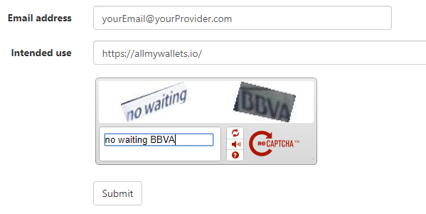

# CryptoID

## Generate an API-key

1. Go to [chainz.cryptoid.com](https://chainz.cryptoid.info/api.key.dws) API Keys section
2. Enter your *Email address*
3. For the *Intended use input*, fill with "https://allmywallets.io/"
4. Enter the captcha code
5. Click on the *Submit* button
  

6. You should have received an email from *do.not.reply@cryptoid.info* with your API Key
