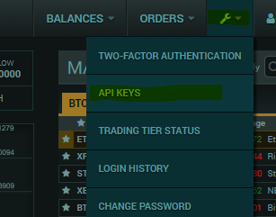

# Poloniex

## Generate an API-key

1. Log into [Poloniex.com](https://poloniex.com/)
2. Hover the wrench on the top right of the website
3. Click on the API-keys section

  

4. Click on the "Create New Key"
5. Make sure your API-key is read-only, the checkboxes "Enable Trading" and "Enable Withdrawals" should be unticked

  
